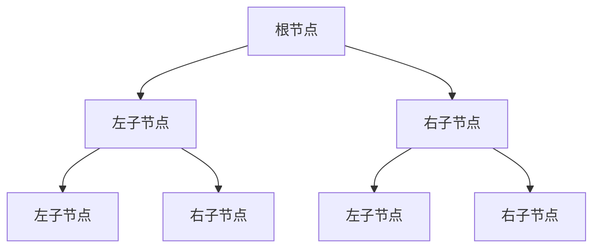
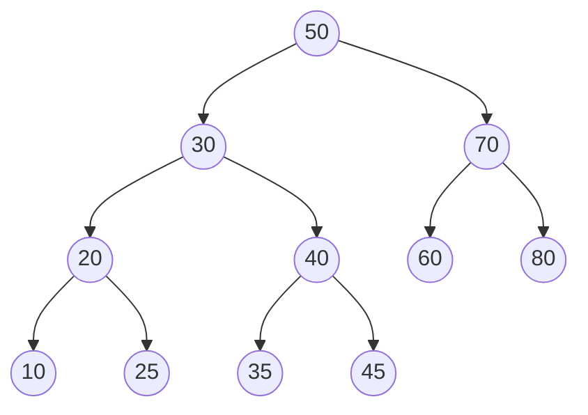

# 二叉树与二叉搜索树

## 什么是二叉树？

二叉树是一种非线性数据结构，其中每个节点最多有两个子节点，通常称为**左子节点**和**右子节点**。这种结构使得二叉树在表达层次关系和进行高效搜索方面具有独特优势。

### 二叉树的基本概念



- **根节点（Root）**：树的最顶层节点，没有父节点
- **叶子节点（Leaf）**：没有子节点的节点
- **子树（Subtree）**：以某个节点为根的树
- **深度（Depth）**：从根节点到该节点的边数
- **高度（Height）**：从该节点到最远叶子节点的边数

### 为什么需要二叉树？

二叉树解决了线性数据结构（如数组、链表）在某些场景下的效率问题：

1. **快速查找**：二叉搜索树可以在 O(log n) 时间内完成查找
2. **动态插入/删除**：相比数组，树结构在插入和删除时不需要移动大量元素
3. **层次关系表达**：天然适合表示具有层次关系的数据

## 二叉搜索树（BST）

二叉搜索树是二叉树的一种特殊形式，它满足以下性质：

> **BST 性质**：对于树中的任意节点，其左子树中所有节点的值都小于该节点的值，右子树中所有节点的值都大于该节点的值。



### BST 的核心操作

#### 1. 查找操作

查找是 BST 最基本的操作，利用 BST 的性质可以快速定位目标值：

```csharp
// 查找指定值的节点
public BinarySearchTreeNode<T>? FindNode(T value)
{
    return FindNodeRecursive(_root, value);
}

private BinarySearchTreeNode<T>? FindNodeRecursive(BinarySearchTreeNode<T>? current, T value)
{
    if (current == null)
        return null;

    int comparison = value.CompareTo(current.Value);

    if (comparison == 0)
        return current;
    else if (comparison < 0)
        return FindNodeRecursive(current.Left, value);
    else
        return FindNodeRecursive(current.Right, value);
}
```

**查找过程示例**：查找值 40

1. 从根节点 50 开始，40 < 50，向左子树查找
2. 到达节点 30，40 > 30，向右子树查找
3. 到达节点 40，找到目标

#### 2. 插入操作

插入操作需要保持 BST 的性质：

```csharp
public void Insert(T value)
{
    var newNode = new BinarySearchTreeNode<T>(value);

    if (_root == null)
    {
        _root = newNode;
    }
    else
    {
        InsertRecursive(_root, newNode);
    }

    _count++;
}

private void InsertRecursive(BinarySearchTreeNode<T> current, BinarySearchTreeNode<T> newNode)
{
    int comparison = newNode.Value.CompareTo(current.Value);

    if (comparison < 0)
    {
        if (current.Left == null)
        {
            current.Left = newNode;
            newNode.Parent = current;
        }
        else
        {
            InsertRecursive(current.Left, newNode);
        }
    }
    else if (comparison > 0)
    {
        if (current.Right == null)
        {
            current.Right = newNode;
            newNode.Parent = current;
        }
        else
        {
            InsertRecursive(current.Right, newNode);
        }
    }
    else
    {
        // 值已存在，忽略重复值
        _count--;
    }
}
```

#### 3. 删除操作

删除操作是 BST 中最复杂的操作，需要考虑三种情况：

```csharp
public bool Remove(T value)
{
    var nodeToRemove = FindNode(value);
    if (nodeToRemove == null)
        return false;

    RemoveNode(nodeToRemove);
    _count--;
    return true;
}

private void RemoveNode(BinarySearchTreeNode<T> node)
{
    // 情况1：叶子节点（没有子节点）
    if (node.Left == null && node.Right == null)
    {
        ReplaceNodeInParent(node, null);
    }
    // 情况2：只有一个子节点
    else if (node.Left == null)
    {
        ReplaceNodeInParent(node, node.Right);
    }
    else if (node.Right == null)
    {
        ReplaceNodeInParent(node, node.Left);
    }
    // 情况3：有两个子节点
    else
    {
        // 找到后继节点（右子树中的最小节点）
        var successor = FindMinimum(node.Right);
        
        // 用后继节点的值替换当前节点的值
        node.Value = successor.Value;
        
        // 删除后继节点（现在它最多只有一个右子节点）
        RemoveNode(successor);
    }
}
```

**删除操作图解**：

- **删除叶子节点**：直接删除
- **删除只有一个子节点的节点**：用子节点替换被删除节点
- **删除有两个子节点的节点**：找到后继节点（右子树中的最小值），用后继节点的值替换被删除节点，然后删除后继节点

#### 4. 遍历操作

BST 支持多种遍历方式，每种遍历都有特定的应用场景：

```csharp
// 中序遍历（左-根-右）- 输出有序序列
public IEnumerable<T> InOrderTraversal()
{
    var result = new List<T>();
    InOrderRecursive(_root, result);
    return result;
}

private void InOrderRecursive(BinarySearchTreeNode<T>? node, List<T> result)
{
    if (node == null) return;
    
    InOrderRecursive(node.Left, result);
    result.Add(node.Value);
    InOrderRecursive(node.Right, result);
}
```

**遍历方式对比**：

| 遍历方式 | 顺序 | 应用场景 |
|---------|------|----------|
| 前序遍历 | 根-左-右 | 复制树、前缀表达式 |
| 中序遍历 | 左-根-右 | **BST 排序**、有序输出 |
| 后序遍历 | 左-右-根 | 释放内存、后缀表达式 |
| 层序遍历 | 逐层从左到右 | 层级处理、广度优先搜索 |

### 时间复杂度分析

| 操作 | 平均情况 | 最坏情况 | 说明 |
|------|----------|----------|------|
| 查找 | O(log n) | O(n) | 最坏情况退化为链表 |
| 插入 | O(log n) | O(n) | 同上 |
| 删除 | O(log n) | O(n) | 同上 |
| 遍历 | O(n) | O(n) | 需要访问所有节点 |

**注意**：当 BST 退化为链表时（例如按顺序插入已排序的数据），所有操作的时间复杂度都会退化为 O(n)。这就是为什么需要平衡二叉树（如 AVL 树、红黑树）的原因。

## 实际应用：文件系统目录结构

二叉搜索树在文件系统中有着广泛的应用。虽然现代文件系统通常使用 B 树或 B+ 树，但 BST 的原理是理解这些数据结构的基础。

### 文件系统中的 BST 应用

```csharp
// 文件系统目录项示例
public class DirectoryEntry
{
    public string Name { get; set; }
    public bool IsDirectory { get; set; }
    public long Size { get; set; }
    public DateTime ModifiedTime { get; set; }

    // 实现 IComparable 接口，用于 BST 排序
    public int CompareTo(DirectoryEntry? other)
    {
        if (other == null) return 1;
        return string.Compare(Name, other.Name, StringComparison.OrdinalIgnoreCase);
    }
}

// 使用 BST 管理目录项
var fileSystem = new BinarySearchTree<DirectoryEntry>();

// 添加文件和目录
fileSystem.Insert(new DirectoryEntry { Name = "Documents", IsDirectory = true });
fileSystem.Insert(new DirectoryEntry { Name = "readme.txt", IsDirectory = false, Size = 1024 });
fileSystem.Insert(new DirectoryEntry { Name = "Images", IsDirectory = true });
fileSystem.Insert(new DirectoryEntry { Name = "photo.jpg", IsDirectory = false, Size = 2048 });

// 按名称排序列出文件
Console.WriteLine("按名称排序的文件列表:");
foreach (var entry in fileSystem.InOrderTraversal())
{
    Console.WriteLine($"{(entry.IsDirectory ? "[DIR]" : "[FILE]")} {entry.Name}");
}
```

### 为什么选择 BST？

1. **快速查找**：在大量文件中快速定位特定文件
2. **有序输出**：中序遍历可以按名称排序输出文件列表
3. **动态管理**：支持动态添加和删除文件

## 完整的 C# 实现

以下是完整的二叉搜索树实现，包含所有核心功能：

```csharp
using System;
using System.Collections;
using System.Collections.Generic;

public class BinarySearchTreeNode<T> where T : IComparable<T>
{
    public T Value { get; set; }
    public BinarySearchTreeNode<T>? Left { get; set; }
    public BinarySearchTreeNode<T>? Right { get; set; }
    public BinarySearchTreeNode<T>? Parent { get; set; }

    public BinarySearchTreeNode(T value)
    {
        Value = value;
    }
}

public class BinarySearchTree<T> : IEnumerable<T> where T : IComparable<T>
{
    private BinarySearchTreeNode<T>? _root;
    private int _count;

    public int Count => _count;
    public bool IsEmpty => _root == null;
    public BinarySearchTreeNode<T>? Root => _root;

    // 插入操作
    public void Insert(T value) { /* 实现代码 */ }
    
    // 查找操作
    public bool Contains(T value) { /* 实现代码 */ }
    public BinarySearchTreeNode<T>? FindNode(T value) { /* 实现代码 */ }
    
    // 删除操作
    public bool Remove(T value) { /* 实现代码 */ }
    
    // 遍历操作
    public IEnumerable<T> InOrderTraversal() { /* 实现代码 */ }
    public IEnumerable<T> PreOrderTraversal() { /* 实现代码 */ }
    public IEnumerable<T> PostOrderTraversal() { /* 实现代码 */ }
    public IEnumerable<T> LevelOrderTraversal() { /* 实现代码 */ }
    
    // 其他辅助方法
    public T? GetMinimum() { /* 实现代码 */ }
    public T? GetMaximum() { /* 实现代码 */ }
    public void PrintTree() { /* 实现代码 */ }
    public static BinarySearchTree<T> FromArray(T[] array) { /* 实现代码 */ }
    
    // IEnumerable 实现
    public IEnumerator<T> GetEnumerator() { /* 实现代码 */ }
    IEnumerator IEnumerable.GetEnumerator() { /* 实现代码 */ }
}
```

## 使用示例

### 基本操作示例

```csharp
// 创建二叉搜索树
var bst = new BinarySearchTree<int>();

// 插入元素
int[] values = { 50, 30, 70, 20, 40, 60, 80, 10, 25, 35, 45 };
foreach (var value in values)
{
    bst.Insert(value);
}

// 打印树结构
bst.PrintTree();
/* 输出：
50
├── 30
│   ├── 20
│   │   ├── 10
│   │   └── 25
│   └── 40
│       ├── 35
│       └── 45
└── 70
    ├── 60
    └── 80
*/

// 查找元素
Console.WriteLine($"查找 40: {bst.Contains(40)}"); // True
Console.WriteLine($"查找 55: {bst.Contains(55)}"); // False

// 中序遍历（有序输出）
Console.WriteLine($"中序遍历: {string.Join(", ", bst.InOrderTraversal())}");
// 输出：10, 20, 25, 30, 35, 40, 45, 50, 60, 70, 80
```

### 性能测试示例

```csharp
var largeBst = new BinarySearchTree<int>();
var random = new Random(42);

// 插入 10000 个随机元素
var startTime = DateTime.UtcNow;
for (int i = 0; i < 10000; i++)
{
    largeBst.Insert(random.Next(0, 100000));
}
var endTime = DateTime.UtcNow;
Console.WriteLine($"插入 10000 个元素: {(endTime - startTime).TotalMilliseconds:F4} 毫秒");

// 查找性能测试
var searchValues = new int[1000];
for (int i = 0; i < 1000; i++)
{
    searchValues[i] = random.Next(0, 100000);
}

startTime = DateTime.UtcNow;
for (int i = 0; i < 1000; i++)
{
    largeBst.Contains(searchValues[i]);
}
endTime = DateTime.UtcNow;
Console.WriteLine($"查找 1000 次: {(endTime - startTime).TotalMilliseconds:F4} 毫秒");
```

## 总结

二叉搜索树是一种强大而灵活的数据结构，它结合了数组的快速查找能力和链表的动态插入/删除能力。通过本文的学习，你应该已经掌握了：

1. **二叉树的基本概念**：节点、子树、深度、高度
2. **BST 的核心性质**：左子树 < 根节点 < 右子树
3. **BST 的核心操作**：插入、查找、删除、遍历
4. **时间复杂度分析**：平均 O(log n)，最坏 O(n)
5. **实际应用场景**：文件系统目录管理

虽然普通的 BST 在最坏情况下可能退化为链表，但它是理解更高级数据结构（如 AVL 树、红黑树、B 树）的基础。在实际应用中，当数据分布较为随机时，BST 通常能提供良好的性能。

**下一步学习建议**：
- 学习平衡二叉树（AVL 树、红黑树）如何避免 BST 退化
- 了解 B 树和 B+ 树在数据库和文件系统中的应用
- 探索堆（完全二叉树）在优先队列中的应用